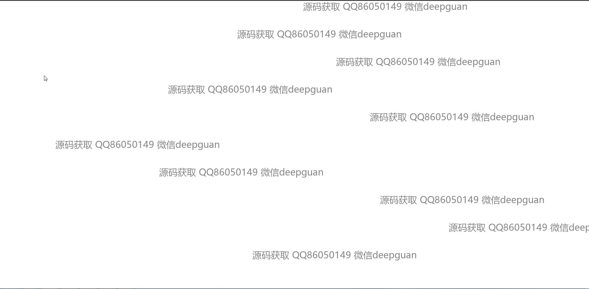
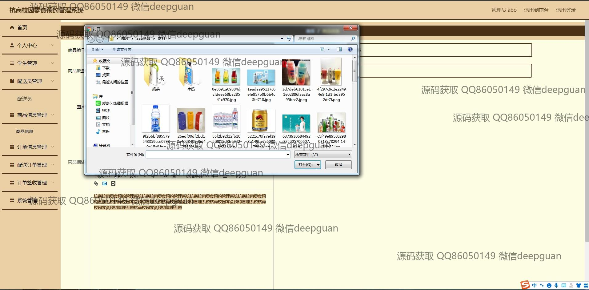

<h1 align="center">杭商校园零食预约管理系统</h1>

## 简介
杭商校园零食预约管理系统：角色分为管理员和学生；提供学生注册、商品信息管理、订单管理、配送管理、支付功能及个人信息管理等功能，界面简洁实用。    --计算机毕业设计源码；毕设源码；java毕业设计源码

## 联系方式

<h3 align="center">获取完整代码与数据库文件 + 微信：deepguan QQ: 86050149 QQ群: 783742310</h3>

<h3 align="center">可帮忙远程部署 包运行成功！提供远程部署、修改代码、设计文档指导、代码讲解等服务！</h3>

## 功能介绍（完整见运行截图）
管理员：拥有多种管理功能，包括登录、注册、和退出系统的能力。可以管理学生和配送员信息，编辑、修改商品信息，处理和跟踪订单信息，分配和调整订单状态。导航菜单提供了个人中心、学生管理、商品信息管理、订单信息管理、配送管理、订单签收和系统管理等模块，管理员可上传文件用于商品信息更新，并处理支付系统保证资金流动的安全性。

配送员：在系统中，配送员的主要职责是订单配送管理。配送员可以通过系统导航访问个人中心和查看被分配的订单，管理和更新自身信息如联系号码。系统提供了订单状态更新功能以便配送员实时标记订单进展，包括待配送、配送中、已完成。配送员还能够查阅详细订单信息，确保准确交付给学生。

学生：可以通过注册登录系统进行零食预约，管理并查看个人信息。学生用户能够浏览商品信息，使用“立即购买”按钮进行零食下单，查看和追踪自己的订单状态。个人中心支持学生修改和更新个人信息如宿舍地址和联系电话。系统便捷的支付方式通过扫码或登入支付宝完成交易，为学生提供顺畅购物体验。

系统用户：系统设置了简洁的用户界面，便于各类用户快速上手和操作。首页导航提供商品推荐和个人中心访问，支持多项功能切换。无论是管理员、配送员还是学生，用户都能通过搜索快速查找信息。系统设计专注于易用性与管理效率，使得零食预约和取货流程透明化，优化了用户的整体体验。

## 运行截图

本代码来源于网络,仅供学习参考使用!

